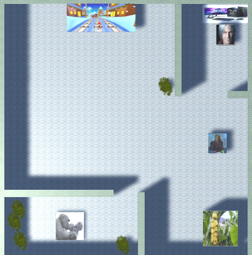
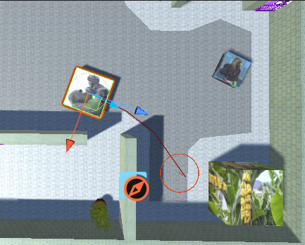
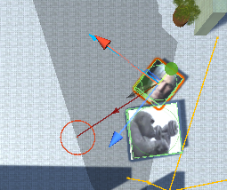
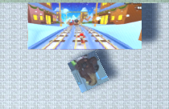

#### Juan Guillermo Zafra Fernández, alu0101353647
# Introduction
The simulation includes three agents that interact with each other to achieve different objectives using GOAP. The stage is set in a zoo of sorts where a caretaker feeds a gorilla and a guard takes care everything goes as it should be. The gorilla's objective is to simply be fed, and even though the caretaker's goal is the same, he can be distracted easily.

## Gorilla
The gorilla simply sits at his cage, with his hunger meter increasing over time. When the hunger meter reaches a parameterized value, he'll be hungry enough to take matters into his own hands. He'll break out of his cage, walk over to the banana tree and feed himself.

With the break out action he'll teleport to a spot outside his cage. The NavMesh is set in a manner such that he can simply walk out, the entrance is too narrow. The approach banana tree action simply puts him in range of grabbing a banana, and feed self resets his hunger if he's close enough to the banana tree. Break out requires a certain amount of hunger to be usable, as a prerequisite.

## Guard
The guard simply wants to relax and play games on his computer on company time, but depending mostly on the caretaker he might have to get out and calm down the gorilla. He has two objectives: gaming and keeping the ape inside the cage. The second one takes precedence over the first one. When the gorilla break out of his cage, the guard approaches him, calms him down using a tranquilizing dart and brings him into his cage, seemingly lifting up 160kg with ease.

The guard has four actions. The one he defaults to when no other tasks are available is game, where he idles in front of his PC. When the gorilla breaks out, he first approaches him. Then, he calms him down, which means disabling the game object's scripts, resetting the agent's path and resetting his hunger, as to avoid the gorilla breaking out repeatedly. Then, the guard makes the gorilla's game object his child game object as to move it along with him, moves to the designated spot and teleports the gorilla inside, enabling thus everything again.

## Caretaker
The caretaker has two goals, feeding the ape and being distracted, the second having a higher priority than the first. By default, the caretaker will get some food and deliver it to the ape, but he might be randomly distracted. Upon being distracted he'll move to the larger screen at the top of the map and stare at videos there for a good while. While this is going on, the ape will most likely become hungry. The rate at which the caretaker becomes distracted and how long he spends watching videos are parameterized.

The caretaker also has four actions. The first one is approaching the spot where he can gather food, then another one to get the food, and a third one to feed the gorilla. He also has an action where he moves in front of the screen and performs the task of watching videos for a set time.

